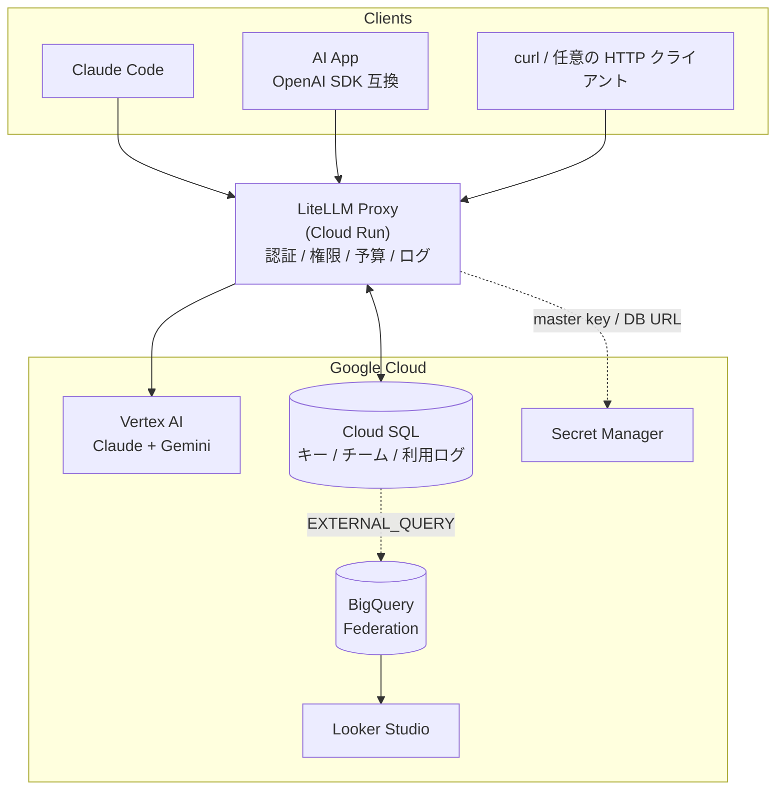

# LLM Gateway Demo

Google Cloud 上で **Claude と Gemini を一元管理** する LLM Gateway のデモ実装です。
[LiteLLM Proxy](https://github.com/BerriAI/litellm) を Cloud Run にデプロイし、
ユーザー/チーム単位の権限管理・予算上限・コスト可視化までをカバーします。

詳細な解説は [docs/article.md](./docs/article.md)（Zenn 投稿のソース）を参照してください。

## アーキテクチャ



## 使用 GCP プロダクト

| プロダクト         | 用途                                             |
| ------------------ | ------------------------------------------------ |
| **Cloud Run**      | LiteLLM Proxy のホスティング                     |
| **Vertex AI**      | Claude / Gemini モデルへのアクセス               |
| **Cloud SQL**      | LiteLLM 内部状態（キー、チーム、予算、利用ログ） |
| **BigQuery**       | Federation で Cloud SQL をリアルタイム分析       |
| **Looker Studio**  | ダッシュボード・可視化                           |
| **Secret Manager** | マスターキー・DB 接続情報の管理                  |
| **IAM**            | サービスアカウントによるアクセス制御             |

## 対応モデル

| モデル名                | プロバイダ                | 用途                     |
| ----------------------- | ------------------------- | ------------------------ |
| `claude-opus-4-6`       | Anthropic (via Vertex AI) | 高度な推論・コーディング |
| `claude-sonnet-4-6`     | Anthropic (via Vertex AI) | バランス型タスク         |
| `gemini-3.1-pro`        | Google (via Vertex AI)    | 最新フラッグシップ推論   |
| `gemini-3.1-flash-lite` | Google (via Vertex AI)    | 高速・低コスト           |
| `gemini-2.5-pro`        | Google (via Vertex AI)    | 安定版高性能推論         |
| `gemini-2.5-flash`      | Google (via Vertex AI)    | 安定版高速推論           |

## クイックスタート

### 1. デプロイ

```bash
# 環境変数を設定（.env.example を参考に）
export PROJECT_ID="your-gcp-project-id"
export LITELLM_MASTER_KEY="your-secure-master-key"  # 省略時は自動生成

# 事前に config.yaml の vertex_project を ${PROJECT_ID} に書き換えるか、
# 同じ値を指定しておきます。

./deploy.sh
```

完了すると Cloud Run の URL とマスターキーが標準出力に表示されます。

### 2. ダッシュボードにアクセス

`<PROXY_URL>/ui` にアクセスし、マスターキーでログインします。

### 3. ユーザー・キーの作成

```bash
export PROXY_URL="https://<your-proxy>.run.app"
export MASTER_KEY="<from-deploy-output>"

# チーム作成
curl -X POST "${PROXY_URL}/team/new" \
  -H "Authorization: Bearer ${MASTER_KEY}" \
  -H "Content-Type: application/json" \
  -d '{"team_alias": "dev-team", "models": ["claude-opus-4-6", "gemini-3.1-pro"], "max_budget": 100.0}'

# API キー発行
curl -X POST "${PROXY_URL}/key/generate" \
  -H "Authorization: Bearer ${MASTER_KEY}" \
  -H "Content-Type: application/json" \
  -d '{"user_id": "user@example.com", "models": ["claude-opus-4-6", "gemini-3.1-pro"], "max_budget": 50.0}'
```

詳しい運用例は [demo-script.md](./demo-script.md) を参照してください。

### 4. Claude Code から接続

`~/.claude/settings.json`:

```json
{
  "env": {
    "ANTHROPIC_BASE_URL": "https://<your-proxy>.run.app",
    "ANTHROPIC_AUTH_TOKEN": "<your-api-key>"
  }
}
```

これだけで Claude Code の全リクエストが Gateway 経由になります。
Claude Code の組み込みツール（Read/Write/Bash/WebSearch 等）はクライアント側実行のため、Gateway を挟んでも問題なく動作します。

`ANTHROPIC_MODEL` を指定すれば既定モデルを上書きできます（例：`"ANTHROPIC_MODEL": "claude-opus-4-6"`）。

<details>
<summary>Vertex AI Pass-through Endpoint を使う場合</summary>

```json
{
  "env": {
    "ANTHROPIC_VERTEX_BASE_URL": "https://<your-proxy>.run.app/vertex_ai/v1",
    "ANTHROPIC_VERTEX_PROJECT_ID": "<your-gcp-project-id>",
    "CLOUD_ML_REGION": "us-east5",
    "CLAUDE_CODE_USE_VERTEX": "1",
    "CLAUDE_CODE_SKIP_VERTEX_AUTH": "1",
    "ANTHROPIC_AUTH_TOKEN": "<your-api-key>"
  }
}
```

</details>

### 5. AI アプリから接続（OpenAI SDK 互換）

LiteLLM Proxy は OpenAI 互換 API を提供します。`base_url` を Gateway に向けるだけで、Claude も Gemini も同じインターフェースで叩けます。

```python
from openai import OpenAI

client = OpenAI(
    base_url="https://<your-proxy>.run.app/v1",
    api_key="<your-api-key>",
)

# Claude
client.chat.completions.create(
    model="claude-sonnet-4-6",
    messages=[{"role": "user", "content": "こんにちは"}],
)

# Gemini（モデル名を切り替えるだけ）
client.chat.completions.create(
    model="gemini-3.1-pro",
    messages=[{"role": "user", "content": "Hello"}],
)
```

## 主な機能

- **ユーザー/チーム単位の予算上限**：超過時は自動 403
- **モデルアクセス制御**：API キーごとに利用可能モデルを制限
- **モデルフォールバック**：`config.yaml` の `fallbacks` で Opus 障害時に Sonnet へ自動切替
- **Anthropic Prompt Caching の透過**：Claude Code / SDK の `cache_control` がそのまま Vertex AI に伝わる（コスト約 1/10）
- **BigQuery Federation でリアルタイム可視化**：ETL 不要で `LiteLLM_DailyUserSpend` を直接クエリ
- **Looker Studio 連携**：[DASHBOARD.md](./DASHBOARD.md) 参照

## ファイル構成

```
llm-gateway-demo/
├── README.md             # このファイル
├── LICENSE               # Apache 2.0
├── .env.example          # 環境変数テンプレート
├── Dockerfile            # LiteLLM コンテナ定義（バージョン固定）
├── config.yaml           # LiteLLM モデル / フォールバック設定
├── deploy.sh             # GCP デプロイスクリプト
├── sync-spend-to-bq.sh   # BQ バッチ同期（Federation の代替）
├── demo-script.md        # デモ手順書
├── DASHBOARD.md          # Looker Studio 設定ガイド
└── docs/
    └── article.md        # Zenn 解説記事ソース
```

## セキュリティ・本番運用上の注意

- デフォルトの `--allow-unauthenticated` は **API キー認証のみ** に依存します。本番環境では IAP / VPC Service Controls / `--no-allow-unauthenticated` + IAM 認証 を推奨。
- LiteLLM のバージョンは [Dockerfile](./Dockerfile) でピン留めしています。**2026 年 3 月の PyPI サプライチェーン攻撃事例** もあるため、本番では SBOM 管理と継続的な脆弱性スキャンを行ってください。
- Cloud SQL は `db-f1-micro`（共有 vCPU / 614 MB）でスタートしています。チーム規模が増えたら `db-g1-small` 以上にスケールアップを検討してください。

## ライセンス

Apache License 2.0 — 詳細は [LICENSE](./LICENSE) を参照。
